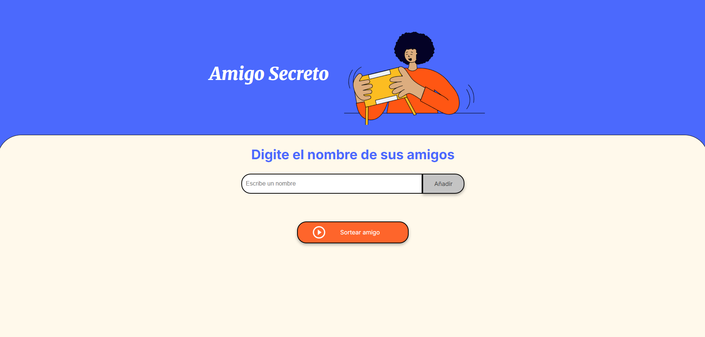
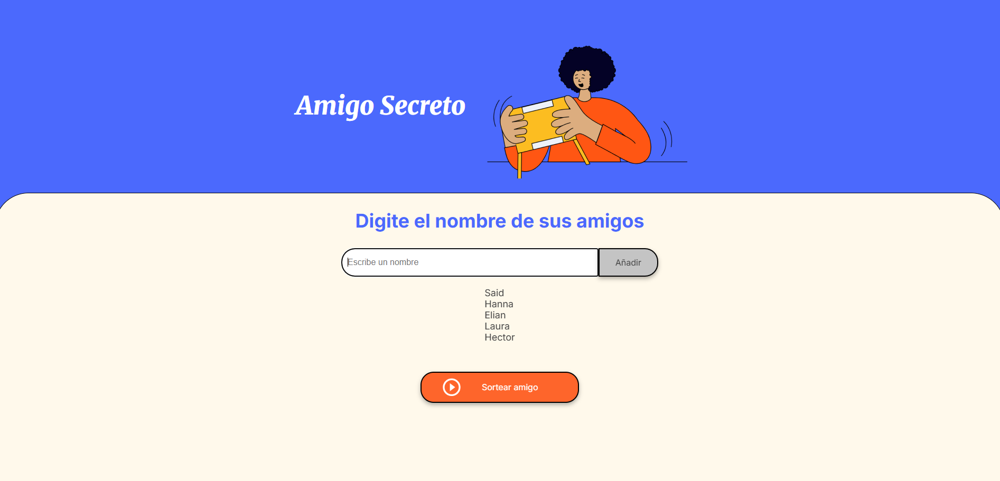
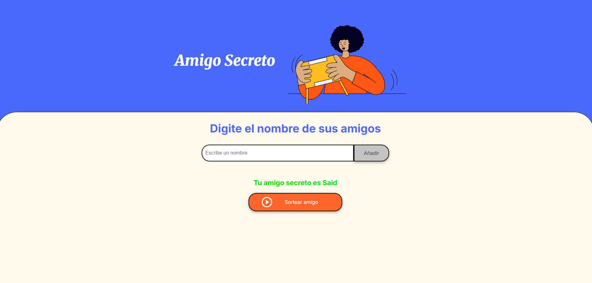

🎁 Amigo Secreto

Aplicación web sencilla para organizar un sorteo de Amigo Secreto. Permite agregar nombres a una lista y luego sortear aleatoriamente a un participante.

🚀 Funcionalidades

Agregar nombres a una lista.

Visualizar todos los amigos ingresados.

Sortear aleatoriamente un amigo secreto.

Validación para evitar entradas vacías.

Interfaz amigable y responsiva.

🖼️ Vista previa

👉 Aquí puedes poner capturas de pantalla del proyecto, por ejemplo:

Pantalla inicial con el cuadro de texto y botón de añadir.

Lista con nombres añadidos.

Resultado del sorteo.

(Tú mismo tomas las capturas de tu navegador y las guardas en la carpeta assets/, luego cambias los nombres en los enlaces de arriba para que se vean en el README.)

🛠️ Tecnologías usadas

HTML5 para la estructura.

CSS3 para estilos.

JavaScript (DOM y Math.random) para la lógica del sorteo.

📂 Estructura del proyecto
📦 amigo-secreto
 ┣ 📂 assets
 ┃ ┣ amigo-secreto.png
 ┃ ┣ play_circle_outline.png
 ┃ ┣ screenshot1.png   ← (captura que agregues tú)
 ┃ ┣ screenshot2.png   ← (captura que agregues tú)
 ┃ ┗ screenshot3.png   ← (captura que agregues tú)
 ┣ 📜 index.html
 ┣ 📜 style.css
 ┣ 📜 app.js
 ┗ 📜 README.md

▶️ Cómo usarlo

Clona el repositorio:

git clone https://github.com/tuusuario/amigo-secreto.git
cd amigo-secreto

Abre index.html en tu navegador.

Ingresa nombres en el cuadro de texto.

Da clic en Añadir.

Cuando tengas todos los participantes, presiona Sortear amigo 🎉.
